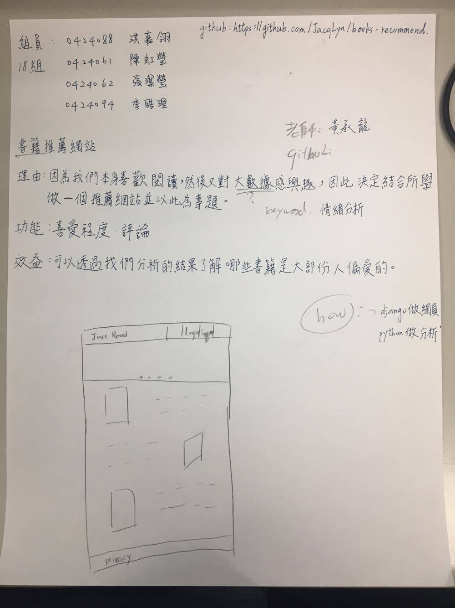
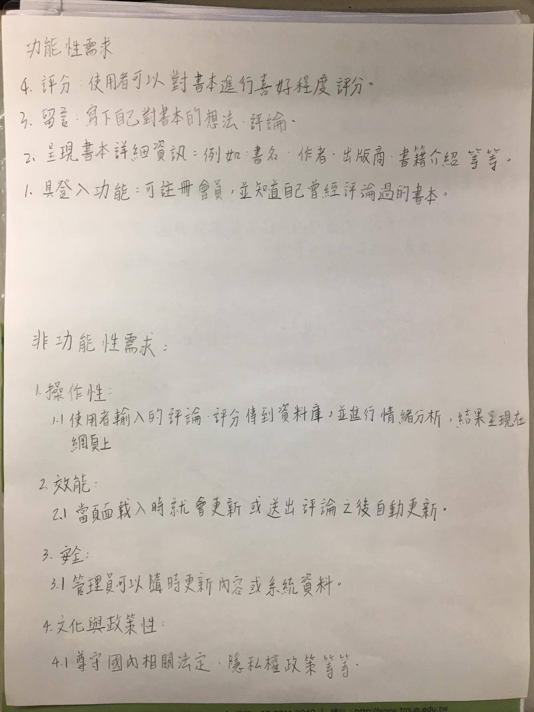
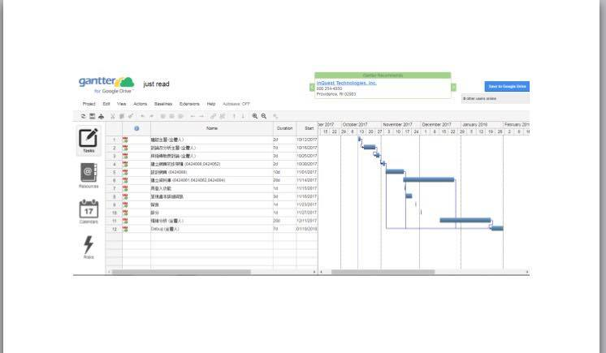
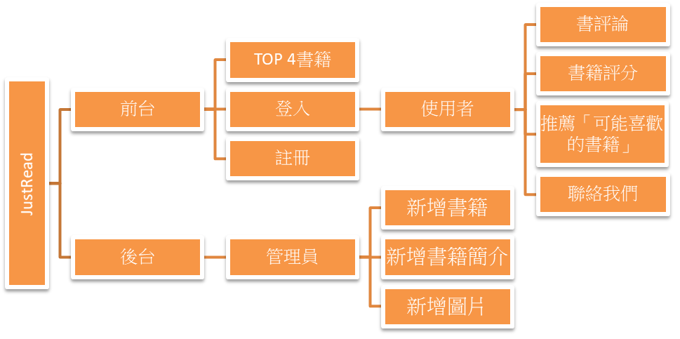
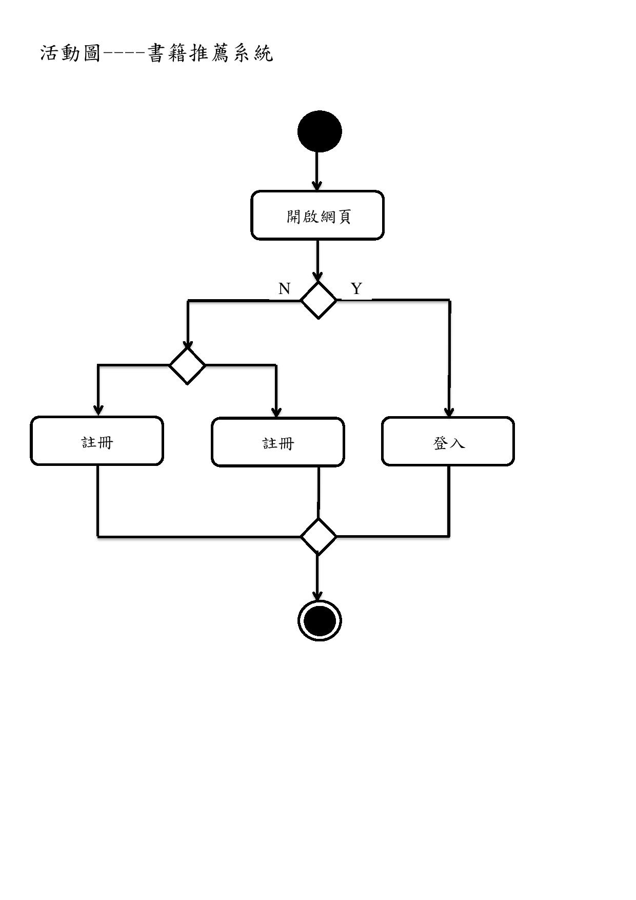

# 專題題目:書籍推薦網站 (第18組) 
## 組員: 0424088 洪嘉翎,0424061 陳虹瑩,0424062 張潔瑩,0424094 李皓理
## 指導教授:黃承龍 教授
## 專題內容:
## 介面:

## 

# 定義需求:

## 

# 甘特圖 :

## 

# 期中考報告 PPT

## 

# 工具 ：

## Django、Python、SQLite、Word2Vec

# 架構圖 ：

## 

# 活動圖 ：

## 
